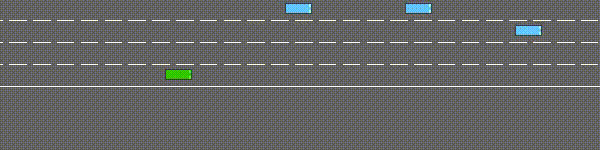
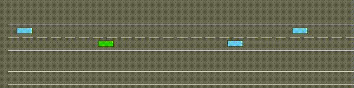
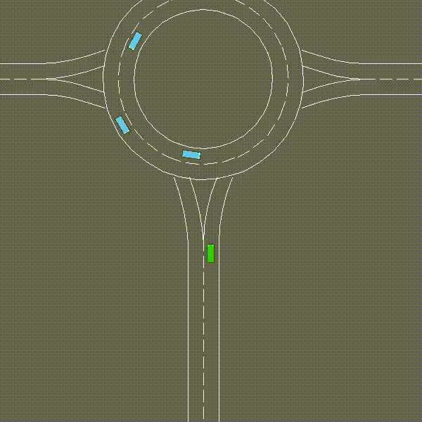
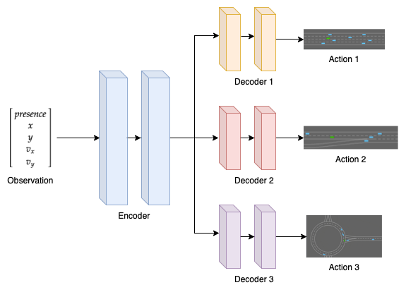

# Multi-Env Decision Making

One of the current major areas of research in Reinforcement Learning is trying to make policies that are generalizable. Currently, in most of the tasks, a policy trained to perform well in an environment starts to struggle when even deployed in a slightly different environment.

We aim to tackle this issue by creating a **_multi-environment_ decision-making policy** that can perform well in different environment settings. We try to achieve this goal by using **Deep Q Network (DQN)** and **modifying its policy network**.

## Environment

We use [Elurent’s Highway-env](https://github.com/eleurent/highway-env) project which offers a collection of environments for autonomous driving and tactical decision-making tasks. From this project, we used three environments named Highway, Merge, and Roundabout for our experiments. The goal of the agent (a.k.a the ego vehicle) is to drive at a high speed without colliding with neighboring vehicles.

  

  
Highway

  

  
Merge

  

  
Roundabout

## Policy

We chose **Deep Q Network** (DQN) to solve this task. The policy network is modified to use an encoder-decoder based Multi-Layer Feed Forward Policy Network (MlpPolicy). The encoder is shared by all the environments and hence learns features that are common to all environments. On the other hand, each environment has a separate decoder that learns the environment-specific features.

  

To train the multi-env policy, the observations are rolled out randomly from all three environments. This enables the policy to learn all environments at once and ensure the presence of a variety of observations in the experience replay buffer.

## Setup Instructions

To run the scripts, first install the necessary packages by running the command

`$ pip install -r requirements.txt`

## Usage

To train the policy

`python run.py --config <path to config yaml>`

To evaluate a policy (without rendering videos in real-time)

`python run.py --config <path to config yaml> -m test -p <path to policy weight>`

To evaluate a policy (with video rendering in real-time)

`python run.py --config <path to config yaml> -m test -p <path to policy weight> --render_video`

## Contact/Getting Help

To know more about the experiments we conducted and their results, please refer to the [blog](https://shantanuacharya.notion.site/Multi-Env-Decision-Making-d40e0ad783e64eebbb755756306e8ed9). If you still have questions, feel free to raise an issue.
